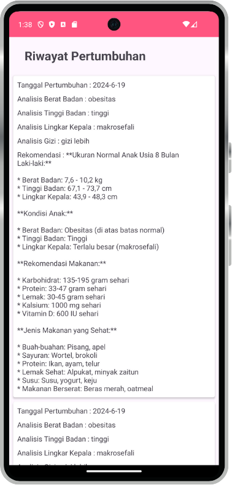
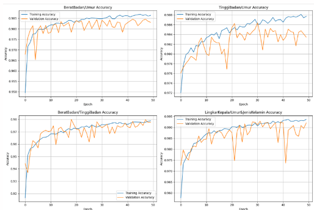

# C241-PS326 Bangkit 2024 Capstone Project

## Project Description

BuahHati is an app that endeavors to address the pressing issue of monitoring and enhancing the growth and development of toddlers, particularly in Indonesia through advanced AI and machine learning technologies.

## Mobile App

<div>
  <p align="center">
    
    
    
  </p>
</div>

## Classification ML Model

<div>
  <p align="center">
    
  </p>
</div>

## Cloud Architecture

<div>
  <p align="center">
    
  </p>
</div>

## Deployment Steps

Here are the steps for deploying this project:

1. Create Google Cloud Platform Project
2. Create a Cloud Storage (Bucket) and enable Cloud Build API for Cloud Run
3. Download the `group1-shard1of1.bin` and `model.json` files from [this link](https://github.com/syagura/Project-Based-Buah-Hati/tree/ml-develop-1/MLP/model/tfjs_model)
4. Put both files into the created bucket, and make sure public access for the bucket is enabled
5. Cloning from [this branch](https://github.com/syagura/Project-Based-Buah-Hati/tree/cc-dev) and add the `.env` file according to `.env.example` file
6. Copy `model.json` link from bucket and then open the `.env` file, paste to the field of MODEL_URL
7. Still on the project and run this command to install dependecies required

```sh
npm install
```

7. Go to GCP and deploy the API to Cloud Run, and the copy the URL link has been created
8. For the android app, open ApiConfig.kt, and change the value of BASE_URL variable to your URL has been created from Cloud Run
9. Open gradle.properties, and change the value of latestinfo_apikey to your News API Key

Done

## Built With Love By C241-PS326:

### Android

- [Galuh Ihsan Nurkholis A214D4KY3691](https://github.com/luhihsan)
- [Javier Jinan Mukti Firjatullah A214D4KY3662](https://github.com/javierjinan22)

### Cloud

- [Adin Rama Ariyanto Putra C006D4KY0613](https://github.com/adinrama)
- [Nicholas Ong C172D4KY0922](https://github.com/ni-cho-las-ong)

### Machine Learning

- [Risky Devandra Hartana M327D4KY3019](https://github.com/riskydevandra)
- [Robi Ardiansyah M327D4KY3024](https://github.com/robiardian)
- [Syahrul Gunawan Ramdhani M327D4KY1630](https://github.com/syagura)
